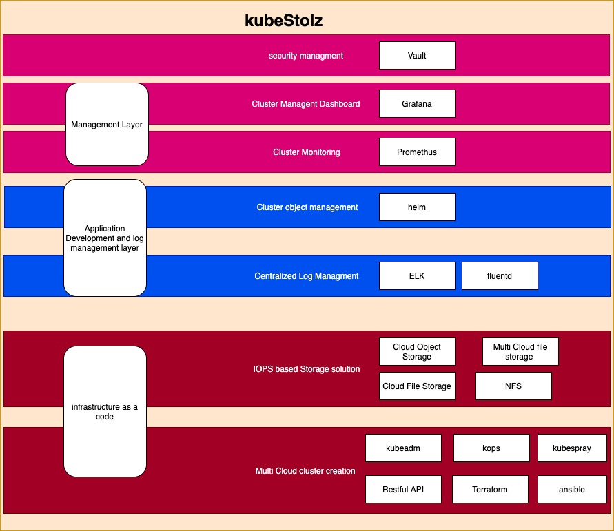
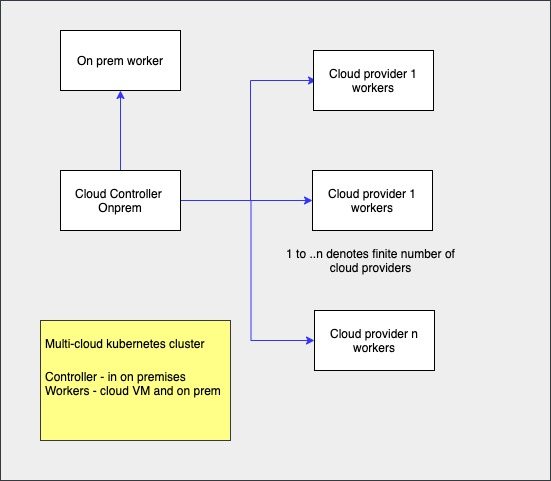
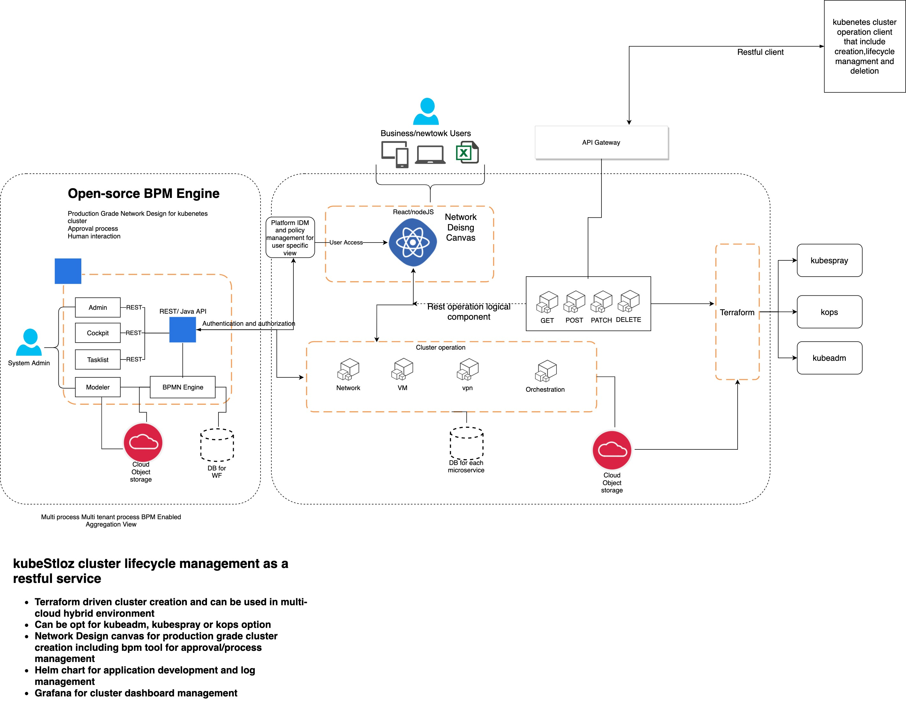
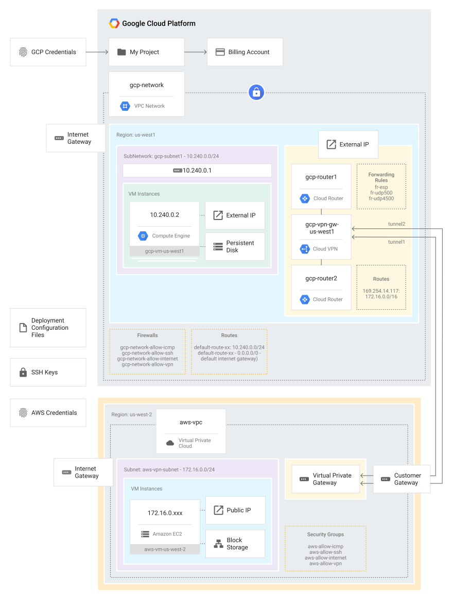

# Welcome to the kubeStolz

## Introduction
KubeStolz is a open-source multi cloud hybrid Kubernetes cluster fully lifecycle management framework, it has been designed in the view of following layers and can be tailored using organization specific requirements 

* Infrastructure as a code that using terraform include file/object storage  selection of cluster creation tool kubeadm, kubespray and kops(only applicable for public cloud infrastructure)
* Application development and log management using helm chart
* Management layer that include Prometheus and Grafana as a management dashboard
* password and security management can be also be integrated and can be stored cloud specific or on-prem secrets and certificates  

<c> Fig 1 KubeStloz frmaework </c>

## concept
It has been designed to provide the view of multi cloud or hybrid cloud environment -control-plane/controller can be fully managed by organization specific private cloud or bare-metal Kubernetes installation

                                         Fig 2 Hybrid kubernetes cluster concept

## Use case(s) that applicable for multicloud hybrid kubenetes cluster

* Organization is using cloud specific databases and application that requires access to the same - can be opt for cluster worker
* Organization is using cloud virtual machine for specific needs and application that requires access to the same - can be opt for cluster worker
* Organization is using cloud specific data-warehouse and application that requires access to the same - can be opt for cluster worker
* cost-effective solution 
* organization requires to control the multi cloud provider/single cloud provider specific virtual machine and specific service under single umbrella - with the help of Kubernetes control plane/controller in private cloud/organization controlled data center

## Road-Map

                                          Fig 3 Information system view
### Components
* Network canvas engine - for drawing production grade network design for the multi cloud cluster, it shall generate json files and can be converted hcl for terraform specific configuration file
* Restful Service for CRUD operation of cluster - output will be converted to hcl for terraform execution
* BMP engine for approval and process specific workflow for network design
* Terraform to execute user specific Kubernetes tool selection -that include kubeadm, kops or kubesray
* Terraform to execute helm specific charts for application development, log and management dashboard
* Openid/corporate idm integration with network canvas/restful service authentication and authorization

## Current-state

                                           Fig 4 gcp-aws multicloud cluster creation using terraform

[Github code repo](https://github.com/tech-inducers/kubeStolz)

## Improvement Area
* Network canvas engine
* Restful service
* Open source bpm integration
* Openid/corporate idm integration

